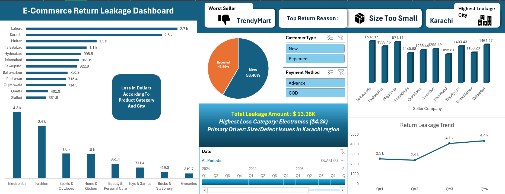
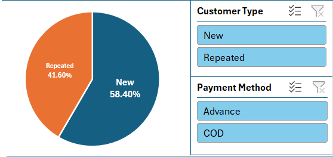
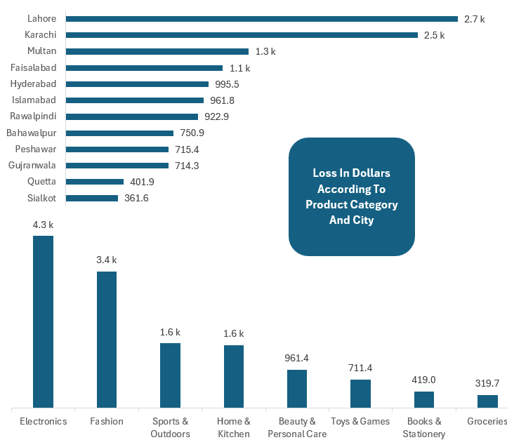
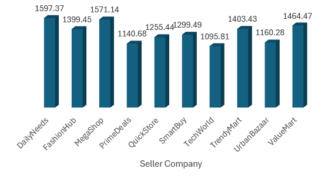
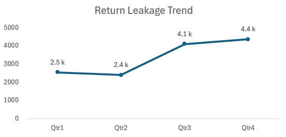
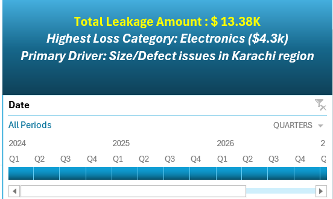

# 📊 E-Commerce Return Leakage Dashboard

<p align="center">


</p>

## 📌 Project Overview

This project is an interactive **Microsoft Excel dashboard** built to analyze **return-related financial losses** In An E-commerce Business

Using **Power Query**, **Pivot=Tables**, **Pivot-Charts**, **Timeline Filters**, **Slicers**, and **Excel analytics**, the dashboard converts raw business data into meaningful insights that support better operational and management decisions.

It enables stakeholders to quickly identify where money is being lost, why returns occur, and which business areas require immediate attention.

---

# 🖼 Dashboard Preview

<p align="center">



</p>

---

# 🎯 Actual Business Problem

Returned orders create hidden costs beyond refunds

Businesses lose money through:

- Product Damage
- Logistics Costs
- Seller Performance Issues
- Customer Return Behaviour
- Category-specific Return Patterns

Without proper analysis, these losses remain difficult to identify.

This dashboard provides a centralized analytical view to monitor and reduce return leakage.

---

# 💼 Business Objective

Design An Executive Dashboard Capable Of Answering Questions Such AS :

- Which City Generates the Highest Financial Loss?
- Which Seller Contributes the Most Leakage?
- Which Product Category Is the Most Expensive?
- What Is the Primary Return Reason?
- How Do Return Losses Change Over Time?
- Which Customer Segment Returns the Most Products?


---

# 📂 Dataset Information

| Attribute | Details |
|-----------|---------|
| Dataset Type | AI Generated Business Dataset |
| Source | Claude AI |
| Software | Microsoft Excel 365 |
| Domain | E-Commerce |
| Records | Simulated Business Transactions |

---

# ⚙ Data Preparation

The dataset was transformed using **Power Query** before visualization.

### Data Cleaning & Transformation

✅ Imported raw dataset
✅ Created a custom business metric
```
Loss on Return = Logistics Cost + Product Damage Cost
```
✅ Converted numeric fields into Currency format

✅ Corrected data types

✅ Reorganized columns for reporting

✅ Loaded transformed data into Excel Data Model


---

# 📊 Dashboard Features

##### Executive KPI Cards

##### Interactive Filters

##### Visualizations
---
# 🛠 Excel Skills Demonstrated

### Excel

- Advanced Pivot Tables
- Pivot Charts
- Interactive Dashboard Design
- KPI Development
- Timeline Filters
- Slicers
- Data Visualization
- Conditional Formatting

---

### Power Query

- Data Import
- Data Cleaning
- Data Transformation
- Custom Columns
- Currency Formatting
- Data Type Conversion

---

### Data Analytics

- Business Analysis
- Trend Analysis
- Customer Segmentation
- Seller Performance Analysis
- Category Analysis

---

# 📚 Excel Functions Used

- SUM
- COUNT
- COUNTIF
- UNIQUE
- SORT
- Aggregation Functions
- Pivot Table Calculations

---

# 🏗 Project Structure

```
├── Data/
│   └── Return_Dataset.xlsx
│
└── Images/
    ├── Dashboard.png
    ├── Dashboard_Title.png
    ├── MainInfo_Cards.png
    ├── CustomerCategory_AndSlicers.png
    ├── SellerCompany_AndLoss_Chart.png
    ├── City_and_Category_Loss.png
    ├── Return_Leakage_Trend_Chart.png
    └── ConcludedInfo_AndTimeline.png
```

---

# 🎯 Business Value

This dashboard helps organizations:

- Reduce operational losses
- Improve seller performance monitoring
- Understand return behaviour
- Detect high-risk categories
- Improve business decision-making
- Track return leakage over time

---


# 🧰 Technologies Used

| Tool | Purpose |
|------|---------|
| Microsoft Excel 365 | Dashboard Development |
| Power Query | Data Cleaning & Transformation |
| Pivot Tables | Data Aggregation |
| Pivot Charts | Visualization |
| Timeline | Date Filtering |
| Slicers | Interactive Analysis |

---

# 👨‍💻 Author

## Malik Waleed Hussain

Computer Science Student | Aspiring Data Analyst

**Skills**

- Excel
- SQL
- Python
- Power BI
- DData Analysis

GitHub:

https://github.com/waleed4we

---

---

# 📸 Dashboard Breakdown

### 🏷 Dashboard Header


---

### 📊 Executive KPI Cards


---

### 👥 Customer Filters & Distribution



---

### 🏙 Return Loss by City & Product Category



---

### 🏢 Seller Performance Analysis



---

### 📈 Return Leakage Trend



---

### 📌 Executive Summary & Timeline




# ⭐ Support

If you found this project helpful or interesting, consider giving it a ⭐ on GitHub.

It helps others discover the project and supports my learning journey.
